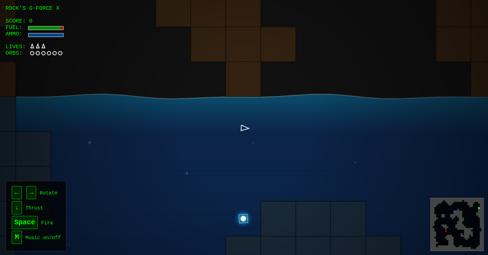
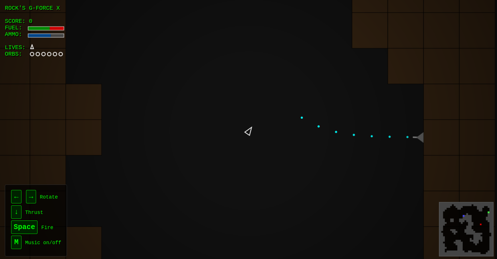

# Rock's G-Force X

A high-precision, momentum-based cave navigator built with HTML5 Canvas.

## todo
- added second player networking

## 🚀 Overview

**Rock's G-Force X** is a modern reimagining of classic 2D cave-flyers. You pilot a scout ship through a massive $3000 \times 3000$ pixel cavern. The game features a unique **Dual-Gravity** system:
* **In Air:** Standard gravity pulls you down.
* **In Water:** Buoyancy pulls you up, accompanied by increased fluid drag.
* Move to the next level each time for a **1K Bonus** and an extra life
* Gain a **10K Bonus** for collecting all orbs in a level
* Collect Magical Orbs for **1K Bonus** each
* Refuel/Rearm your ship on your home (starting) pad
* Destroy or Avoid Turrets protecting the cave system

The terrain is procedurally generated using **Cellular Automata**, ensuring that every playthrough offers a unique, connected, and organic labyrinth.

---

## 🎮 Controls

The game uses standard keyboard inputs with UTF-8 support for HUD legend display:

| Key             | Action                   |
|:----------------|:-------------------------|
| **Left Arrow**  | Rotate Counter-Clockwise |
| **Right Arrow** | Rotate Clockwise         |
| **Down Arrow**  | Engages Main Thrusters   |
| **Space Bar**   | Fire                     |

---

## ✨ Features

-   **High-Res Procedural Caves:** A $30 \times 30$ grid system creating massive $100\text{px}$ terrain blocks for a retro-tactile feel.
-   **Smart Connectivity:** Every cavern is processed with a **Flood Fill** algorithm to ensure no isolated "pockets"—if you can see it, you can fly to it.
-   **Physics Engine:** -   Asteroids-style momentum (thrust adds to velocity).
    -   Dynamic drag constants based on environmental medium (Air vs. Water).
    -   Pixel-perfect tile collision detection.
-   **VFX System:** -   **Particle Explosions:** Ship shatters into physics-based fragments upon impact.
    -   **Dynamic HUD:** Real-time depth tracking and environmental status updates.
    -   **Minimap:** A real-time $150\text{px}$ navigation suite in the corner.

---

## 🛠️ Technical Details

-   **Language:** JavaScript (ES6+)
-   **Renderer:** HTML5 Canvas API
-   **World Scale:** 3000 x 3000 World Units
-   **Performance:** Implemented draw-culling (only tiles within the camera viewport are rendered) to maintain a smooth 60 FPS.

---

## 🏗️ Setup & Installation

1. Clone the repository.
2. Open `index.html` in any modern web browser.
3. No dependencies or build steps required—just pure JS.

---
