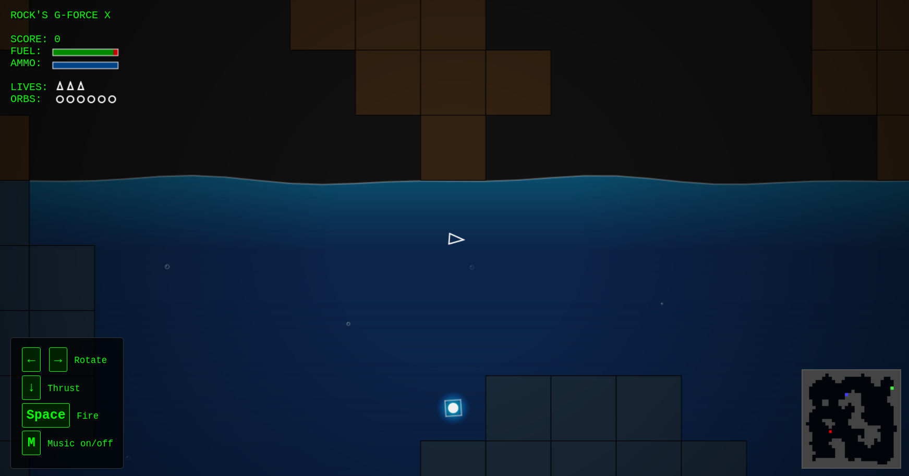
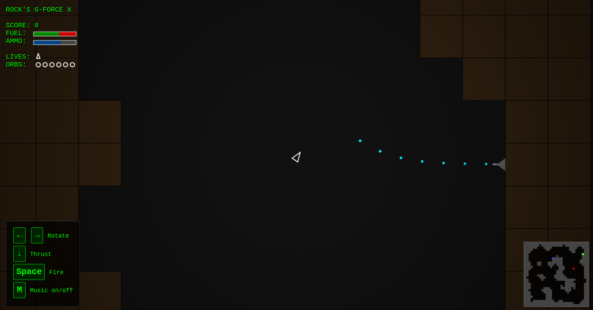

# Rock's G-Force X

A high-precision, momentum-based cave navigator built with HTML5 Canvas.

## todo
- added second player networking

## 🚀 Overview

**Rock's G-Force X** is a modern reimagining of classic 2D cave-flyers. You pilot a scout ship through a massive $3000 \times 3000$ pixel cavern. The game features a unique **Dual-Gravity** system:
* **In Air:** Standard gravity pulls you down.
* **In Water:** Buoyancy pulls you up, accompanied by increased fluid drag.
* Move to the next level each time for a **1K Bonus** and an extra life
* Gain a **10K Bonus** for collecting all orbs in a level
* Collect Magical Orbs for **1K Bonus** each
* Refuel/Rearm your ship on your home (starting) pad
* Destroy or Avoid Turrets protecting the cave system
* Outfly the **AI Opponent** — an identical ship, in red, flying out of its own pad
  somewhere else in the cave. Shoot it down for a **5K Bonus**; touch it and you both die.


The terrain is procedurally generated using **Cellular Automata**, ensuring that every playthrough offers a unique, connected, and organic labyrinth.







---

## 🎮 Controls

The game uses standard keyboard inputs with UTF-8 support for HUD legend display:

| Key             | Action                   |
|:----------------|:-------------------------|
| **Left Arrow**  | Rotate Counter-Clockwise |
| **Right Arrow** | Rotate Clockwise         |
| **Down Arrow**  | Engages Main Thrusters   |
| **Space Bar**   | Fire                     |

---

## ✨ Features

-   **High-Res Procedural Caves:** A $30 \times 30$ grid system creating massive $100\text{px}$ terrain blocks for a retro-tactile feel.
-   **Smart Connectivity:** Every cavern is processed with a **Flood Fill** algorithm to ensure no isolated "pockets"—if you can see it, you can fly to it.
-   **Physics Engine:** -   Asteroids-style momentum (thrust adds to velocity).
    -   Dynamic drag constants based on environmental medium (Air vs. Water).
    -   Pixel-perfect tile collision detection.
-   **VFX System:** -   **Particle Explosions:** Ship shatters into physics-based fragments upon impact.
    -   **Dynamic HUD:** Real-time depth tracking and environmental status updates.
    -   **Minimap:** A real-time $150\text{px}$ navigation suite in the corner.
-   **AI Opponent:** An autonomous ship flying the same underactuated hull you do — see below.

---

## 🤖 The AI Opponent

The enemy flies the player's exact ship: it can only rotate, and thrust along its nose. It
runs as two layers on two clocks, the way a real autonomy stack is built.

**The planner** (`nav.js`, ~10 Hz) is what it knows about the cave:

-   A **clearance field** — a Chebyshev distance transform, computed once per level, giving
    every tile its distance to the nearest rock.
-   **A\*** across the grid, where the step cost is charged an extra $1 + w/\text{clearance}$,
    so routes prefer the middle of a cavern to scraping along a wall.
-   **String pulling** over a DDA voxel raycast, which collapses the staircase A\* returns
    into a few smooth diagonal legs.

**The controller** (`enemy.js`, every frame) flies the route:

-   An **arrive** law for desired velocity, damped by the velocity error — the derivative
    term of a PD loop, so it settles onto a waypoint instead of swinging past it.
-   **Medium cancellation:** $T = a_{cmd} - g_{eff} + v(1-\text{drag})$. Since `BUOYANCY` is
    negative, this one term flips sign below the waterline: in air the ship points **up** and
    burns against gravity, and submerged it pitches **down** and burns downwards to hold its
    depth. The reversal is not a special case — it falls out of the physics.
-   **Gravity is free:** it never burns in the direction the medium already pulls, which keeps
    the nose permanently in the half-plane that can fight it.
-   **Wall avoidance** in two halves: a Khatib repulsive potential $k(1/d - 1/R)/d^2$ for the
    static barrier, plus the braking law $v^2/2s$ that asks what deceleration would actually
    be needed to stop in the gap left — charged against the distance the ship drifts while it
    turns, because on this hull the binding constraint is turn time, not thrust.
-   **Speed rationed by clearance** — flat out across a cavern, a crawl down a crack.

**The gun** solves for interception in closed form. Bullets inherit the shooter's velocity, so
with $d$ the gap and $w$ the relative velocity, substituting $s = 1/t$ into
$|d/t + w| = \text{AMMO\_SPEED}$ gives a quadratic

$$|d|^2 s^2 + 2(d \cdot w)s + (|w|^2 - \text{AMMO\_SPEED}^2) = 0$$

whose largest positive root is the soonest interception; the aim is then $d s + w$, normalised,
and line-of-sight checked so it never fires into rock.

Every gain, range and cooldown is a named constant in `const.js`. Set `ENEMY_DEBUG_PATH = true`
to draw the route it has planned.

---

## 🛠️ Technical Details

-   **Language:** JavaScript (ES6+)
-   **Terrain simulation:** WebAssembly (AssemblyScript), with a JavaScript fallback
-   **Renderer:** HTML5 Canvas API
-   **World Scale:** 3000 x 3000 World Units
-   **Performance:** Implemented draw-culling (only tiles within the camera viewport are rendered) to maintain a smooth 60 FPS.

---

## 🏗️ Setup & Installation

1. Clone the repository.
2. Open `index.html` in any modern web browser and select **Launch WASM game**.
3. No dependencies or build steps are required to play the checked-in build.

### WebAssembly terrain module

The procedural cave generation, material selection, and rock damage state are compiled
to `wasm/dist/terrain.wasm`. The checked-in binary lets the game run immediately; rebuild
it after changing `wasm/assembly/terrain.ts`:

```bash
cd wasm
npm install
npm run build
npm test
```

When served over HTTP, the browser fetches the compact WASM binary directly:

```bash
node server.js
```

Opening `index.html` directly also works: the build generates `wasm/terrain-inline.js`,
an embedded copy of the same binary for browsers that block `file://` WASM fetches.

### Distribution

Create a browser-ready zip with the compiled WASM, game assets, and local server:

```bash
make dist
```

The archive is written to `dist/gforcex-js-wasm.zip`. Extract it and open `index.html`,
or run `node server.js` from the extracted folder and browse to `http://localhost:3000`.

---
